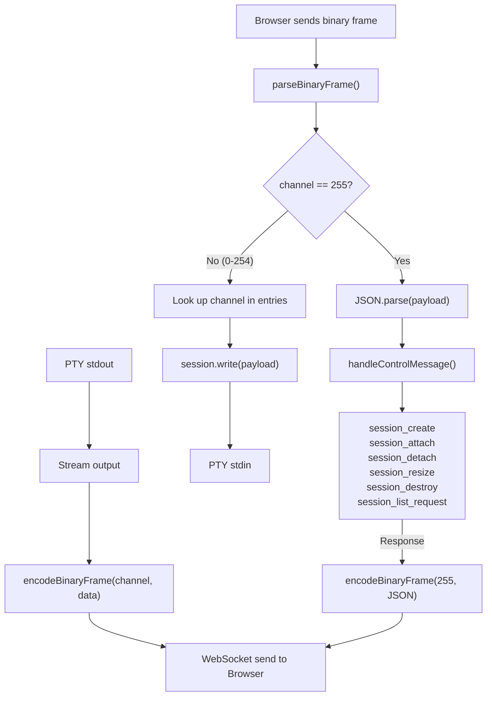

# A Binary Protocol for Terminal Multiplexing

*Part 3 of the Wormhole Build Journal*

JSON is great until you're shipping raw terminal bytes at 60fps.

## Why Binary

In the first two posts I built a single-session terminal over
WebSockets. That version sent everything as text: keystrokes went up
as strings, terminal output came back as strings, control messages
were JSON objects. Simple, easy to debug with browser devtools.

Then I added multiplexing: multiple terminal sessions over one
WebSocket connection. Now the server needs to tell the client
"these bytes belong to session A" and "these bytes belong to
session B." The obvious approach is to wrap each chunk in a JSON
envelope:

```json
{"sessionId": "abc-123", "data": "bG9yZW0gaXBzdW0="}
```

That `data` field is base64-encoded terminal output. Every byte of
real content becomes ~1.33 bytes on the wire, plus the JSON framing
overhead, plus a `JSON.parse()` call on the hot path for every
single chunk of terminal output. When you have four sessions
streaming simultaneously, that parse-and-decode cycle adds up fast.

Terminal output is already bytes. The PTY emits bytes. The terminal
emulator on the client consumes bytes. Wrapping them in JSON just
to unwrap them on the other side is busywork.

So I did what felt natural: put the routing information in the
bytes themselves.

## The 1-Byte Channel Framing Design

The protocol is almost embarrassingly simple:

```
+----------+-----------------------+
| byte 0   | bytes 1..N            |
| channel  | payload               |
+----------+-----------------------+
```

One byte of overhead per frame. That's it. The channel byte tells
you where the payload goes:

- **Channels 0 through 254**: raw terminal I/O, one channel per
  session.
- **Channel 255**: JSON control messages (session lifecycle, resize
  events, listings).

Why one byte? Because it's the minimum possible overhead on the
hot path. 255 data channels is far more than enough for a personal
terminal multiplexer. I'll never have 255 shells open at once. But
if I ever do, varint encoding is backward-compatible: channel 254
could mean "the next byte is the high channel number." That escape
hatch costs nothing today.

## The Code

Here is the binary framing layer from `Protocol.ts`. The entire
thing is under 20 lines:

```typescript
/**
 * Channel 255 is reserved for JSON control messages.
 * Channels 0-254 carry raw terminal I/O.
 */
export const CONTROL_CHANNEL = 255;

/**
 * Binary frame: [1-byte channel][payload].
 */
export const encodeBinaryFrame = (
  channel: number,
  payload: Uint8Array,
): Uint8Array => {
  const frame = new Uint8Array(1 + payload.length);
  frame[0] = channel;
  frame.set(payload, 1);
  return frame;
};

export const parseBinaryFrame = (
  frame: Uint8Array,
): { channel: number; payload: Uint8Array } => ({
  channel: frame[0],
  payload: frame.subarray(1),
});
```

A few things worth noting:

- `frame.subarray(1)` returns a view into the original buffer.
  No copy. The payload bytes never move.
- `encodeBinaryFrame` does allocate a new `Uint8Array`, but only
  to prepend a single byte. This is the one allocation on the hot
  path and it's as small as it can be.
- There's no length prefix. WebSocket messages are already framed
  by the protocol itself; each `onmessage` event delivers exactly
  one complete message. I don't need to reassemble fragments.

## Control Messages with Effect Schema

The binary framing solves the data plane. For the control plane
(creating sessions, attaching, resizing, listing) I still use JSON.
These messages are infrequent and benefit from runtime validation.

Each control message is an `Effect Schema.Class`, which gives me
runtime validation and TypeScript types from a single definition:

```typescript
export class SessionCreateRequest
  extends Schema.Class<SessionCreateRequest>(
    "SessionCreateRequest",
  )({
    type: Schema.Literal("session_create"),
    cols: Schema.Number,
    rows: Schema.Number,
  }) {}

export class SessionCreatedResponse
  extends Schema.Class<SessionCreatedResponse>(
    "SessionCreatedResponse",
  )({
    type: Schema.Literal("session_created"),
    sessionId: Schema.String,
    channel: Schema.Number,
  }) {}
```

The `type` field is a `Schema.Literal`, so each message is a tagged
union variant. When I combine them into the full `ControlMessage`
union, `Schema.decodeUnknownEither` picks the right branch based on
the `type` discriminant:

```typescript
export const ControlMessage = Schema.Union(
  SessionCreateRequest,
  SessionAttachRequest,
  SessionDetachRequest,
  SessionResizeRequest,
  SessionDestroyRequest,
  SessionListRequest,
);
```

This is one definition doing three jobs: TypeScript type, runtime
decoder, and documentation of what the protocol accepts. If I add a
field or a new message type, the compiler tells me everywhere that
needs to change.

## Why JSON for Control, Binary for Data

This split felt obvious once I thought about the access patterns:

**Terminal I/O** is high-throughput, latency-sensitive, and opaque.
The server does not inspect the contents; it just routes bytes from
a PTY to a WebSocket channel and vice versa. Every byte of overhead
here multiplies across every keystroke and every line of output.

**Control messages** are infrequent (a handful per session lifetime)
and structured. They benefit from schema validation because a
malformed resize message should be caught immediately, not silently
corrupt PTY state. The overhead of JSON serialization is irrelevant
when you send maybe ten control messages per minute.

## Channel Allocation

When a client creates or attaches to a session, the server assigns
it a channel number. The `ChannelMap` tracks the bidirectional
mapping between channel numbers and session IDs:

```typescript
export interface ChannelMap {
  readonly assign: (
    sessionId: string,
  ) => Effect.Effect<number, ChannelExhaustedError>;
  readonly release: (channel: number) => Effect.Effect<void>;
  readonly getSessionId: (
    channel: number,
  ) => Option.Option<string>;
  readonly getChannel: (
    sessionId: string,
  ) => Option.Option<number>;
}
```

The implementation is a pair of `Map`s with a free list for channel
reuse:

```typescript
export const make = (
  maxChannels: number = 255,
): Effect.Effect<ChannelMap> =>
  Effect.sync(() => {
    const channelToSession = new Map<number, string>();
    const sessionToChannel = new Map<string, number>();
    const freeList: number[] = [];
    let nextChannel = 0;

    return {
      assign: (sessionId) =>
        Effect.gen(function* () {
          const existing = sessionToChannel.get(sessionId);
          if (existing !== undefined) return existing;

          let channel: number;
          if (freeList.length > 0) {
            channel = freeList.pop()!;
          } else {
            if (nextChannel >= maxChannels) {
              return yield* new ChannelExhaustedError({
                maxChannels,
              });
            }
            channel = nextChannel++;
          }
          channelToSession.set(channel, sessionId);
          sessionToChannel.set(sessionId, channel);
          return channel;
        }),

      release: (channel) =>
        Effect.sync(() => {
          const sessionId = channelToSession.get(channel);
          if (sessionId !== undefined) {
            channelToSession.delete(channel);
            sessionToChannel.delete(sessionId);
            freeList.push(channel);
          }
        }),
      // ...
    };
  });
```

A few design choices here:

- **Idempotent assign**: calling `assign("session-a")` twice
  returns the same channel. No accidental double-allocation.
- **Free list reuse**: when a session detaches, its channel goes
  back into the pool. Channels are cheap; leaking them is not.
- **Typed error**: when all 255 channels are exhausted, the
  function returns a `ChannelExhaustedError`, not an exception.
  The caller is forced to handle it. In the mux handler, that
  means closing the WebSocket with a specific error code (4003).

## The Message Table

Here is the full protocol at a glance.

**Client to Server:**

| Message              | Fields              | Purpose          |
|----------------------|---------------------|------------------|
| `session_create`     | cols, rows          | New session      |
| `session_attach`     | sessionId,cols,rows | Reattach existing|
| `session_detach`     | sessionId           | Disconnect       |
| `session_resize`     | sessionId,cols,rows | Resize PTY       |
| `session_destroy`    | sessionId           | Permanent delete |
| `session_list_request` | (none)            | List sessions    |

**Server to Client:**

| Message              | Fields                       | Purpose       |
|----------------------|------------------------------|---------------|
| `session_created`    | sessionId, channel           | Session ready |
| `session_exit`       | sessionId, channel, exitCode | Shell exited  |
| `session_list`       | sessions[]                   | List response |

Ten message types total. Every field is validated by Effect Schema
at decode time.

## Parsing: Graceful Failure with Option

Incoming messages from the WebSocket could be anything: valid JSON,
garbage, or raw terminal bytes that a confused client sent to the
control channel. The parser wraps `Schema.decodeUnknownEither` in
an `Option` so bad input simply becomes `None` instead of throwing:

```typescript
const decodeControlMessage =
  Schema.decodeUnknownEither(ControlMessage);

export const parseMessage = (
  data: string,
): Option.Option<ControlMessage> => {
  if (!data.startsWith("{")) return Option.none();
  let parsed: unknown;
  try {
    parsed = JSON.parse(data);
  } catch {
    return Option.none();
  }
  return Either.match(decodeControlMessage(parsed), {
    onLeft: () => Option.none(),
    onRight: (msg) => Option.some(msg),
  });
};
```

The `startsWith("{")` check is a fast-path rejection: if the string
doesn't even look like JSON, skip the parse entirely. This matters
because `parseMessage` used to run on *every* incoming WebSocket
message in the pre-multiplexing server, including raw terminal
keystrokes. Most messages are a few characters of keyboard input,
so this short-circuit avoids a lot of wasted work.

## How It All Flows

Here is the full picture of how a binary frame travels through the
system:



The mux handler on the server is a direct translation of this
diagram. Here is the hot path from `muxHandler.ts`:

```typescript
const handleMessage = (data: Uint8Array): Effect.Effect<void> =>
  Effect.gen(function* () {
    const { channel, payload } = parseBinaryFrame(data);

    if (channel === CONTROL_CHANNEL) {
      let json: unknown;
      try {
        json = JSON.parse(decoder.decode(payload));
      } catch {
        return;
      }
      yield* handleControlMessage(
        json as Record<string, unknown>,
      );
      return;
    }

    const entry = entries.get(channel);
    if (!entry) return;
    yield* entry.session.write(decoder.decode(payload));
  });
```

And the reverse direction, PTY output streaming back to the
browser:

```typescript
const startOutputFiber = (
  channel: number,
  sessionId: string,
  handle: ClientHandle,
) =>
  Effect.gen(function* () {
    yield* Effect.raceFirst(
      handle.output.pipe(
        Stream.runForEach((data) =>
          send(encodeBinaryFrame(channel, encoder.encode(data))),
        ),
      ),
      Deferred.await(handle.exited).pipe(Effect.asVoid),
    );
    // If the PTY exited, notify the client on the control channel
    if (yield* Deferred.isDone(handle.exited)) {
      const exitCode = yield* Deferred.await(handle.exited);
      yield* sendControl(
        new SessionExitResponse({
          type: "session_exit",
          sessionId,
          channel,
          exitCode,
        }),
      );
    }
  });
```

Each attached session gets its own output fiber. The fiber reads
from the PTY's output stream, wraps each chunk in a binary frame
with the session's channel number, and sends it down the WebSocket.
When the PTY exits, it sends a `session_exit` control message on
channel 255 so the client knows the shell is gone.

## The Browser Side

The client mirrors the server's framing exactly. In
`WormholeGateway.tsx`, the `onmessage` handler does the same
channel dispatch:

```typescript
ws.onmessage = (event) => {
  const frame = new Uint8Array(event.data as ArrayBuffer);
  const { channel, payload } = parseBinaryFrame(frame);

  if (channel === CONTROL_CHANNEL) {
    const msg = JSON.parse(decoder.decode(payload));
    switch (msg.type) {
      case "session_created":
        for (const cb of createdListeners.current) cb(msg);
        break;
      case "session_exit":
        for (const cb of exitListeners.current) cb(msg);
        break;
      case "session_list":
        for (const cb of listListeners.current) cb(msg.sessions);
        break;
    }
    return;
  }

  // Data channel: route to terminal subscriber
  const listeners = channelListeners.current.get(channel);
  if (listeners && listeners.size > 0) {
    for (const listener of listeners) listener(payload);
  } else {
    // Buffer until a subscriber registers
    if (!channelBuffers.current.has(channel)) {
      channelBuffers.current.set(channel, []);
    }
    channelBuffers.current.get(channel)!.push(payload);
  }
};
```

The buffering at the end is worth calling out. There's a race
condition between "server sends session_created + first output
bytes" and "React mounts the terminal component that subscribes to
that channel." If the terminal output arrives before the subscriber
registers, the buffer catches it. When the subscriber shows up, the
buffer flushes. No lost bytes.

## What I Got Wrong Along the Way

My first attempt had the channel number as a 2-byte big-endian
unsigned integer. I thought "what if 255 channels isn't enough?"
and burned two bytes of overhead per frame for a problem I didn't
have. After a day of working with it, I realized that every line of
code touching the channel number was more complex than it needed to
be: `DataView`, byte offsets, endianness. I ripped it out and went
with one byte. The code got simpler, the frames got smaller, and
the escape hatch (varint via channel 254) covers the hypothetical
future.

Another mistake: I initially tried to be clever with the control
channel by assigning it channel 0 and using channels 1 through 255
for data. This meant the first session got channel 1, which isn't
wrong, but it broke a mental model where "channel N" maps neatly to
"the Nth session I opened." Putting control on channel 255 (the
top of the range) means data channels start at 0, which is cleaner
for indexing into arrays and maps.

## Lesson: Let the Domain Guide the Wire Format

The terminal domain told me everything I needed to know about the
protocol design:

- Terminal I/O is opaque bytes; treat it as opaque bytes on the
  wire.
- Control messages are structured data; treat them as structured
  data on the wire.
- The multiplexing factor is small (personal use); keep the channel
  identifier small.

I didn't start from "let's design a protocol." I started from "what
is the simplest framing that lets me route bytes to the right
session?" The answer was one byte, and it has held up through every
feature I've added since.

---

*Next in the series: session resurrection and the scrollback ring
buffer.*
