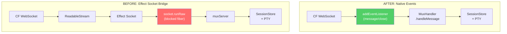

# Killing Your Abstractions

I spent weeks building an Effect Socket abstraction. Then I
deleted it.

This is the story of a bug that looked like a lifecycle
issue, turned out to be an architecture issue, and ended
with me ripping out one of the most "elegant" pieces of code
in the project.

## The bug

Open wormhole in the browser. Terminal works. Type commands,
see output. Everything is fine.

Hit refresh.

Blank screen. The WebSocket reconnects. The Durable Object
creates a new `MuxHandler`. The session is there in the
`SessionStore`. But no terminal output appears. And
somewhere in the background, the old connection's fibers are
still running, holding onto resources that will never be
released.

This is the kind of bug that makes you question everything.

## The architecture that broke

The original `WormholeDO` used a bridge to connect
Cloudflare's WebSocket API to Effect's streaming
abstractions. Cloudflare WebSockets have a different API
than browser WebSockets: you call `server.accept()`, you get
events via `addEventListener`. Effect's `Socket` module
expects a `TransformStream`. So I wrote a bridge.

The bridge, `cfWebSocketToSocket`, was the kind of code I
was proud of. It created a `ReadableStream` that piped CF
WebSocket messages into it, a `WritableStream` that sent
bytes back out, and wrapped them in
`Socket.fromTransformStream`. This let the mux server use
Effect's streaming APIs end to end:

```typescript
const cfWebSocketToSocket = (
  ws: WebSocket,
): Effect.Effect<Socket.Socket> => {
  const acquire = Effect.sync(
    (): Socket.InputTransformStream => ({
      readable: new ReadableStream<string | Uint8Array>({
        start(controller) {
          ws.addEventListener("message", (evt) => {
            if (typeof evt.data === "string") {
              controller.enqueue(evt.data);
            } else {
              controller.enqueue(
                new Uint8Array(evt.data as ArrayBuffer),
              );
            }
          });

          ws.addEventListener("close", () => {
            try {
              controller.close();
            } catch {
              /* stream already closed */
            }
          });
        },
        cancel() {
          ws.close();
        },
      }),
      writable: new WritableStream<Uint8Array>({
        write(chunk) {
          ws.send(chunk);
        },
        close() {
          ws.close(1000);
        },
      }),
    }),
  );

  return Socket.fromTransformStream(acquire);
};
```

Clever. Composable. The whole connection became a single
Effect fiber running `socket.runRaw`, which internally does
`await reader.read()` in a loop. All the mux logic
downstream could use Effect's `Stream` and `Fiber` APIs
without knowing anything about Cloudflare.

The problem: when the browser refreshes, the old tab's
WebSocket is gone. The Durable Object still has that old
connection's fiber running. It is sitting inside
`socket.runRaw`, which is sitting inside
`await reader.read()`, waiting for the next message from a
browser tab that no longer exists.

That `await` is raw JavaScript. Effect cannot interrupt it.
The fiber is stuck forever.

## Why `activeWs.close()` didn't fix it

My first instinct was simple: when a new connection arrives,
close the old WebSocket.

```typescript
// My first attempt at fixing it
if (this.activeWs) {
  this.activeWs.close(1000, "Replaced by new connection");
}
```

This does not work. Here is why.

Cloudflare's server-side `ws.close()` sends a close frame
to the remote peer. It initiates the WebSocket close
handshake. But the remote peer is the old browser tab, which
is gone. It refreshed. There is nobody on the other end to
complete the handshake.

The close handshake never completes. The "close" event never
fires on the server-side WebSocket. The `ReadableStream`
controller never calls `controller.close()`. The
`ReadableStream` never ends. The `reader.read()` call never
resolves. The Effect fiber stays blocked.

I tried adding a timeout. I tried calling `controller.close`
manually. Each fix introduced new edge cases. The bridge
was fighting me at every turn.

## The hard decision

After several hours of increasingly creative workarounds, I
stepped back and looked at the problem differently.

The issue is not the code. It is the architecture.

Bridging CF WebSocket to ReadableStream to Effect Socket
creates an uninterruptible layer. There is a raw JavaScript
`await` in the middle of an Effect fiber, and no amount of
Effect-level lifecycle management can reach through that
`await` to cancel it.

The only real fix: remove Effect Socket from the WebSocket
I/O path entirely.

This meant deleting `cfWebSocketToSocket`. It meant deleting
`muxServer.ts`, the 210-line file that used
`socket.runRaw`. It meant rewriting the Durable Object. It
meant rewriting all the tests.

I liked that code. I was proud of how cleanly it composed.
But it was the wrong abstraction for this platform.

## The new architecture

The new design uses Effect for what it is good at: domain
logic, service composition, fiber lifecycle, typed errors.
And it uses the platform for what the platform is good at:
receiving WebSocket events.



The key insight: instead of making the mux server own the
socket and run a read loop, make it a handler that receives
messages. A `MuxHandler` takes a `send` callback instead of
owning a `Socket`:

```typescript
export interface MuxHandler {
  readonly handleMessage: (
    data: Uint8Array,
  ) => Effect.Effect<void>;
  readonly cleanup: Effect.Effect<void>;
}

export const make = (options: {
  readonly send: (
    data: Uint8Array,
  ) => Effect.Effect<void>;
  readonly close: (
    code: number,
    reason: string,
  ) => Effect.Effect<void>;
}): Effect.Effect<
  MuxHandler,
  never,
  SessionStore
> => // ...
```

The Durable Object wires it up with native events:

```typescript
const handler = await this.runtime.runPromise(
  Server.makeMuxHandler({ send, close }),
);
this.activeHandler = handler;
this.activeWs = server;

server.addEventListener("message", (evt: MessageEvent) => {
  const data =
    evt.data instanceof ArrayBuffer
      ? new Uint8Array(evt.data)
      : new TextEncoder().encode(evt.data as string);
  this.runtime.runFork(handler.handleMessage(data));
});

server.addEventListener("close", () => {
  this.cleanupConnection();
});
```

Each WebSocket message becomes an independent Effect,
forked and forgotten. No long-lived fiber. No
`await reader.read()`. No bridge.

## The refactoring

This was not a quick change. Fifteen hours of work across
163 turns. Here is what it looked like:

1. Created `muxHandler.ts`: the message-based handler that
   takes `send`/`close` callbacks instead of a `Socket`.
   Same mux logic, fundamentally different ownership model.

2. Exported `makeMuxHandler` from `Server.ts`.

3. Migrated all mux tests from the socket-based API to the
   handler-based API.

4. Rewrote `WormholeDO.ts` to use native `addEventListener`
   and the new `MuxHandler`.

5. Deleted `muxServer.ts`. Two hundred and ten lines, gone.

The commit sequence tells the story:

```
e5e32bc feat(wormhole): add message-based MuxHandler
03ec11d feat(wormhole): export makeMuxHandler from Server
4cb25df refactor(wormhole): migrate mux tests to MuxHandler
0089d5f refactor(wormhole): event-driven WS in WormholeDO
27bf4d1 chore(wormhole): remove Socket-based muxServer
```

Build the replacement first. Migrate consumers. Delete the
old code last. Never break the build.

## Before and after

The old `WormholeDO.fetch` was a single forked fiber:

```typescript
// BEFORE: one fiber owns the entire connection
this.runtime.runFork(
  Effect.gen(function* () {
    const socket = yield* cfWebSocketToSocket(server);
    yield* handleMuxConnection(socket);
  }).pipe(Effect.scoped),
);
```

If that fiber gets stuck, you cannot replace the connection.
You cannot clean up. You are at the mercy of JavaScript's
event loop and whether the underlying `ReadableStream`
decides to close.

The new `WormholeDO` is explicit about connection
replacement:

```typescript
// AFTER: connection cleanup is a plain method call
private cleanupConnection(): void {
  if (this.activeHandler) {
    this.runtime.runFork(this.activeHandler.cleanup);
  }
  if (this.activeWs) {
    try {
      this.activeWs.close(1000, "Replaced by new connection");
    } catch {
      /* already closed */
    }
  }
  this.activeHandler = null;
  this.activeWs = null;
}
```

When a new connection arrives, `cleanupConnection()` runs
first. It interrupts the handler's fibers (output
distribution, exit watchers) and closes the old WebSocket.
No blocked fiber to worry about. The cleanup runs in
milliseconds.

## What I learned

The bridge was not bad code. It was well-typed, well-tested,
and it composed beautifully with Effect's streaming APIs.
In a different environment, say a Node.js server where
`socket.close()` actually closes the socket immediately, it
would have been fine.

But Cloudflare's WebSocket close semantics are different.
The close handshake requires a remote peer. When that peer
is a browser tab that just refreshed, the handshake hangs.
And when the handshake hangs, the ReadableStream hangs. And
when the ReadableStream hangs, any fiber sitting in
`await reader.read()` hangs.

The abstraction hid this platform behavior behind a clean
interface. That is exactly what made the bug so hard to find.
I was debugging Effect fibers and Durable Object lifecycles
for hours before I realized the problem was a raw JavaScript
`await` buried three layers deep in a bridge function.

There is a general principle here: when an abstraction
fights the platform, remove the abstraction. Do not add more
layers on top. Do not work around the mismatch. Acknowledge
that the abstraction does not fit this environment and
replace it with something that does.

Effect is still everywhere in wormhole. It manages the
`SessionStore`. It manages PTY lifecycle. It manages fiber
interruption and typed errors and service composition. It is
excellent at all of those things. But it is not managing the
WebSocket read loop anymore, because the WebSocket read loop
is a platform concern, and the platform handles it better
than any abstraction can.

The code got simpler. The `MuxHandler` interface is
two fields: `handleMessage` and `cleanup`. The Durable
Object is 95 lines instead of 144. The connection
replacement works on the first try, every time.

Sometimes the best thing you can do for your codebase is
delete the code you are most proud of.
