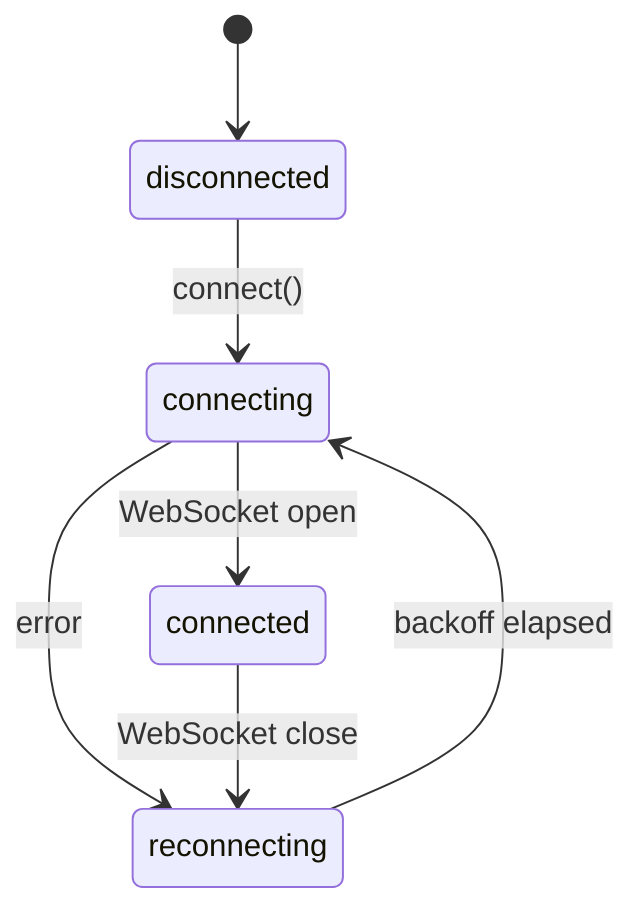

# Making Sessions Immortal

Sessions survive PTY death. They do not survive DO
eviction. Yet.

## Where things stand

Posts 5 and 6 covered resurrection: the PTY process crashes,
the session stays alive in memory with its scrollback buffer
intact, and when a client reattaches, the session respawns a
fresh PTY. No data loss, no manual intervention. The user
reconnects and picks up where they left off.

This works because the `Session` object holds a `RingBuffer`
of recent output and a `Ref` tracking the PTY process. When
the process exits, the ref goes to `null`, the session enters
an "exited" state, and the attach path knows to respawn. All
of this lives in memory inside the Durable Object.

The key phrase there is "in memory."

## The gap

Durable Objects are not permanent processes. Cloudflare
evicts them after a period of inactivity. The worker
restarts on deploys. Your laptop sleeps and the WebSocket
drops; if no other client is connected, the DO eventually
gets evicted.

When it wakes back up, it starts fresh. Empty session store.
No scrollback. No layout. Every session you had is gone.

This is the gap between "sessions survive crashes" and
"sessions survive everything." Resurrection handles the
process lifecycle. It does not handle the infrastructure
lifecycle.

## The plan

The fix is nine tasks across four themes. Here is how they
break down.

### Serialization primitives

Before you can persist anything, you need to serialize it.
`RingBuffer` gets `serialize()` and `fromSnapshot()` methods
for round-tripping its contents through JSON. Then a
`SessionCheckpoint` schema captures everything about a
session at a point in time:

```typescript
export class SessionCheckpoint extends Schema.Class<
  SessionCheckpoint
>("SessionCheckpoint")({
  id: Schema.String,
  name: Schema.NullOr(Schema.String),
  cwd: Schema.NullOr(Schema.String),
  createdAt: Schema.Number,
  buffer: Schema.Struct({
    entries: Schema.Array(Schema.String),
    totalBytes: Schema.Number,
    capacity: Schema.Number,
  }),
}) {}
```

This is an Effect Schema class, which means it carries
its own encoder and decoder. DO Storage handles plain
objects natively, so there is no need for manual binary
serialization.

### Session lifecycle

Sessions get metadata: a name, a working directory, a
creation timestamp. The session list response gets richer,
carrying `isExited`, `name`, `cwd`, and `lastActiveAt`
alongside the existing `id` and `clientCount`. A new
`session_rename` control message lets clients name their
sessions.

The critical addition is `Session.restore(checkpoint)`: a
constructor that creates a session from a checkpoint in the
exited state. The `RingBuffer` is pre-filled from the
snapshot. The PTY ref starts as `null`. When a client
attaches, the existing respawn logic kicks in and spawns a
fresh shell. The session comes back to life with its
scrollback intact.

### DO Storage

Three integration points in `WormholeDO`:

**Hydrate on wake.** In `blockConcurrencyWhile`, the DO
reads all `session:*` keys from storage and calls
`store.restore(checkpoint)` for each one. By the time the
first WebSocket message arrives, every session from the
previous incarnation is already in the session store, waiting
for a client to reattach.

**Periodic checkpoint via `alarm()`.** Every 30 seconds, the
DO snapshots all sessions into a batch write. This is a
deliberate choice over transactional per-write persistence:
terminal I/O is high-throughput, and writing to storage on
every PTY output event would be expensive and unnecessary.
The alarm batches everything into a single `storage.put()`
call. Worst case, you lose 30 seconds of scrollback. For a
personal tool, that is an acceptable trade-off.

**Checkpoint on disconnect.** When the last client
disconnects, the DO writes an immediate checkpoint before
cleanup. This minimizes the window between the last state
change and eviction.

### Client resilience

The frontend gets two pieces. First, a reconnection state
machine:



Exponential backoff with jitter, capped at 30 seconds.
The machine never gives up. This is a personal tool; if
my laptop sleeps for eight hours and wakes up, I want it
to reconnect without me touching anything.

Second, layout persistence in `localStorage`. The pane
tree, session-to-pane mapping, and focused pane are saved
on every mutation (debounced 500ms) and on `beforeunload`.
On page load, the layout restores from storage and
reattaches all sessions. If a session no longer exists on
the server (maybe I explicitly destroyed it from another
device), the orphaned pane gets cleaned up after the
enriched session list comes back.

One more small change: closing a pane now sends
`session_destroy` instead of `session_detach`. Detach
keeps the session alive for reattachment. Destroy kills
it and removes it from storage. Without this distinction,
every session would live forever, and the session list
would grow without bound.

## Key design decisions

**Why `alarm()` instead of transactional writes.** Terminal
output is a firehose. Writing to DO Storage on every chunk
would burn through the write budget and add latency to the
hot path. The alarm approach checkpoints the world every 30
seconds in a single batch. The only risk is losing recent
scrollback on a hard crash, and for a personal tool, that
risk is acceptable.

**Why `localStorage` for layout.** Layout is a client
concern. Different devices might want different layouts.
Persisting it server-side would mean syncing layout state
across devices, which adds complexity for questionable
benefit. `localStorage` is simple, fast, and scoped to the
device.

**Why "never give up" reconnection.** Commercial products
give up after N retries and show an error modal. I do not
want that. I want to close my laptop on Friday, open it on
Monday, and see my terminals reconnect. The backoff caps at
30 seconds, which is cheap enough to run indefinitely.

## What this means for the user

The end state: I open wormhole on my desktop, create three
terminal panes, run a build in one, tail logs in another,
edit in the third. I close my laptop. I open my phone. Same
three panes, same scrollback, same layout. I close the
phone. The DO eventually gets evicted. A week later I open
my laptop. The DO wakes, hydrates from storage, and my
sessions are there. I reattach, the shells respawn, and my
scrollback is intact.

Sessions that survive process death. Sessions that survive
infrastructure eviction. Sessions that survive device
switches. Sessions that survive me forgetting about them for
a week.

Immortal sessions.

## Closing

Seven posts ago, this series started with a question: why
build your own terminal multiplexer? The answer was that
nothing gives you multiplexed terminals that live at the
edge and follow you across devices.

Post by post, the pieces came together. A library with a
clean Pty interface. A binary protocol. A PTY on Cloudflare's
edge. Structured concurrency lessons learned the hard way.
Abstractions killed when they fought the platform. A tiled
layout in the browser.

This post is the last piece of the puzzle: making sure none
of that work gets thrown away when the infrastructure
restarts. From "why build this" to "it never dies."

Time to ship it.

---

*This is post 8 of 7+1 in the wormhole build journal.
The bonus round.*
