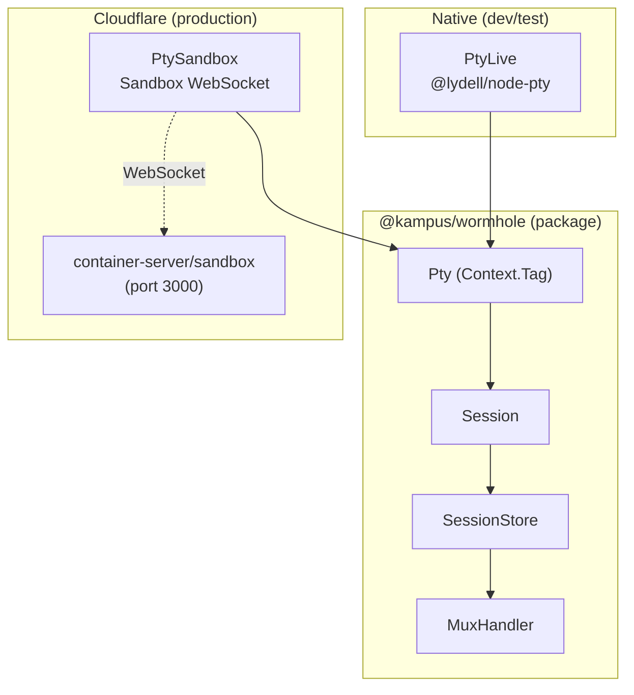
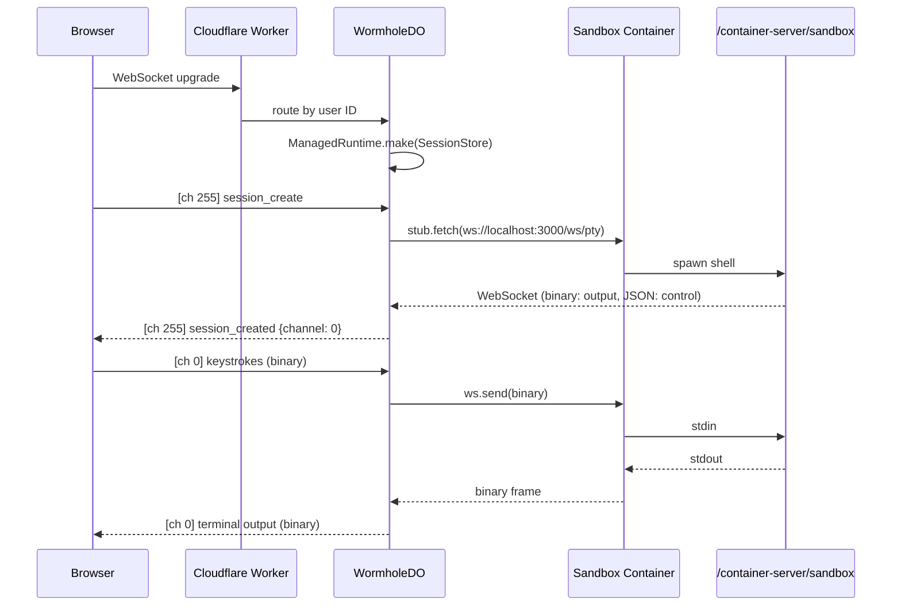

# Running a PTY on Cloudflare's Edge

*Part 4 of the Wormhole Build Journal*

Cloudflare doesn't give you a shell. Unless you know where to
look.

## The Constraint

Cloudflare Workers run inside V8 isolates. No file system, no
processes, no native addons. The wormhole library from the
previous three posts uses `@lydell/node-pty` to spawn shells,
and node-pty is a native C++ addon. You cannot `require()` a
native addon inside a V8 isolate. Full stop.

For months this was a blocker. The multiplexing layer, the
binary protocol, the session store: all of it was tested and
ready. But it assumed a Unix process model that does not exist
on Cloudflare's runtime.

Then Cloudflare shipped Sandbox: containers at the edge with a
`terminal()` API. A Durable Object can spin up a container, get
a WebSocket to a real PTY inside it, and pipe bytes to the
browser. The missing piece was suddenly there.

Getting it to work took 21 hours.

## The 21-Hour Debugging Marathon

The session was titled "Fix PtySandbox to use official
Cloudflare Sandbox image and SDK APIs." Here is a compressed
version of what went wrong and in what order.

### Wrong Docker Image

I started with a bare `ubuntu:22.04` Dockerfile:

```dockerfile
FROM ubuntu:22.04
RUN apt-get update && apt-get install -y \
    --no-install-recommends bash curl git \
    && rm -rf /var/lib/apt/lists/*
CMD ["bash"]
```

This is a perfectly fine container. It is also completely useless
for Cloudflare Sandbox. The Sandbox SDK communicates with a
binary called `/container-server/sandbox` that must be running
inside the container on port 3000. That binary handles terminal
WebSocket connections, process lifecycle, and the control
protocol. Without it, every SDK method hits a connection refused
error.

The official image, `cloudflare/sandbox:0.7.1`, ships with this
binary baked in. I was building a custom container from scratch,
missing the one piece that makes the Sandbox API work.

The fix was two lines:

```dockerfile
FROM docker.io/cloudflare/sandbox:0.7.1
EXPOSE 8080
```

That is the entire Dockerfile. No apt-get, no custom packages,
no CMD. The base image handles everything.

### Manual stub.fetch() vs the SDK Pattern

Even after switching to the right image, I was calling the
Sandbox wrong. My first implementation treated it like a generic
Durable Object: grab the stub, construct a URL, call
`stub.fetch()`. This is how you talk to most DOs, but Sandbox
is not most DOs.

Here is the path the request took in my broken version:

```
PtySandbox
  -> stub.fetch("http://localhost/ws/pty?cols=80")
    -> cf-container-target-port header -> port 3000
      -> bare ubuntu (no sandbox binary)
        -> FAIL: connection refused
```

The `stub.fetch()` call goes through Cloudflare's
`containerFetch`, which expects an HTTP server running inside
the container. My ubuntu container was running `bash` as PID 1.
There was no HTTP server. There was no sandbox binary. There was
nothing listening on any port.

The intermediate fix was to call `stub.terminal()` instead of
`stub.fetch()`:

```typescript
const resp = yield* Effect.tryPromise({
  try: () =>
    stub.terminal(upgradeReq, {
      cols: options.cols,
      rows: options.rows,
    }),
  catch: (cause) =>
    new PtySpawnError({shell: "sandbox", cause}),
});
```

This got closer. The `terminal()` method knows how to connect to
the sandbox binary's PTY endpoint. But it still failed because
the container did not have the sandbox binary. The image fix and
the API fix were both necessary; neither alone was sufficient.

### The Fix

The final working version does two things right. First, the
correct Docker image. Second, it inlines the URL construction
that the SDK's `proxyTerminal()` does internally, pointing at
`http://localhost:3000/ws/pty`:

```
PtySandbox
  -> stub.fetch("http://localhost:3000/ws/pty?sessionId=...")
    -> Sandbox base class
      -> container's /container-server/sandbox binary
        -> terminal WebSocket
```

I inlined the URL construction instead of importing
`proxyTerminal` from `@cloudflare/sandbox` because that import
pulls in `@cloudflare/containers`, which is unresolvable in the
test environment (vitest-pool-workers). The URL format is stable
and documented in Cloudflare's own collaborative-terminal
example. Pragmatic over pure.

Here is the progression across three commits:

```
448e8c6  feat: add WormholeSandbox + SandboxBinding tag
         (ubuntu:22.04, stub.fetch with custom headers)

ecec06e  fix: use Sandbox.terminal() instead of stub.fetch()
         (still ubuntu:22.04, terminal() API, still broken)

b9223d9  fix: use official Sandbox image + SDK-compatible routing
         (cloudflare/sandbox:0.7.1, inline proxyTerminal URL)
```

## PtySandbox: Bridging the Pty Interface to a WebSocket

The key architectural insight: wormhole already had a `Pty`
interface as an Effect `Context.Tag`. PtyLive wraps node-pty.
PtySandbox wraps a Sandbox WebSocket. The rest of the system
does not know or care which one is running underneath.



The Sandbox's WebSocket multiplexes control and data on a single
connection:

- **Binary frames**: raw terminal I/O bytes
- **JSON text frames**: control messages (resize, exit, ready)

This maps neatly onto the PtyProcess interface. Binary frames
become the output stream. JSON exit messages resolve the exit
deferred. Resize sends a JSON text frame. Write sends binary.

Here is the spawn implementation from `PtySandbox.ts`:

```typescript
const spawnImpl = (
  binding: DurableObjectNamespace<Sandbox>,
  options: SpawnOptions,
): Effect.Effect<PtyProcess, PtySpawnError, never> =>
  Effect.gen(function* () {
    const sandboxId = options.env?.SANDBOX_ID ?? "default";
    const id = binding.idFromName(sandboxId);
    const stub = binding.get(id);

    const sessionId = `${sandboxId}-default`;
    const params = new URLSearchParams({sessionId});
    if (options.cols)
      params.set("cols", String(options.cols));
    if (options.rows)
      params.set("rows", String(options.rows));

    const upgradeReq = new Request(
      `http://localhost:3000/ws/pty?${params}`,
      {
        headers: new Headers({
          Upgrade: "websocket",
          Connection: "Upgrade",
        }),
      },
    );

    const resp = yield* Effect.tryPromise({
      try: () => stub.fetch(upgradeReq),
      catch: (cause) =>
        new PtySpawnError({shell: "sandbox", cause}),
    });
    const ws = resp.webSocket;
    if (!ws) {
      return yield* new PtySpawnError({
        shell: "sandbox",
        cause: new Error(
          "No WebSocket in terminal response"
        ),
      });
    }
    ws.accept();

    // ... wire up output stream, exit deferred, write/resize
  });
```

The WebSocket event handlers deserve attention. Unlike PtyLive
where `onData` and `onExit` are separate callbacks, Sandbox
multiplexes everything on one connection. I register handlers
eagerly and buffer data until the Effect stream starts consuming:

```typescript
let emitter: ((data: string) => void) | null = null;
let endStream: (() => void) | null = null;
const buffer: string[] = [];
let ended = false;

ws.addEventListener("message", (evt: MessageEvent) => {
  if (typeof evt.data === "string") {
    try {
      const msg = JSON.parse(evt.data);
      if (msg.type === "exit") {
        Effect.runSync(
          Deferred.succeed(exitDeferred, msg.code ?? 0)
        );
        ended = true;
        endStream?.();
        return;
      }
      return;
    } catch {
      if (emitter) emitter(evt.data);
      else buffer.push(evt.data);
    }
  } else {
    const text = new TextDecoder().decode(
      evt.data as ArrayBuffer
    );
    if (emitter) emitter(text);
    else buffer.push(text);
  }
});
```

The output stream then flushes the buffer on first consumption:

```typescript
const output = Stream.asyncPush<string>((emit) =>
  Effect.acquireRelease(
    Effect.sync(() => {
      for (const data of buffer) emit.single(data);
      buffer.length = 0;
      if (ended) {
        emit.end();
        return;
      }
      emitter = (data: string) => emit.single(data);
      endStream = () => emit.end();
    }),
    () =>
      Effect.sync(() => {
        try {
          ws.close();
        } catch {
          // WebSocket may already be closed
        }
      }),
  ),
);
```

And the write path sends binary for terminal input, JSON for
resize:

```typescript
write: (data: string) =>
  guardAlive(() => {
    ws.send(new TextEncoder().encode(data));
  }),
resize: (cols: number, rows: number) =>
  guardAlive(() =>
    ws.send(JSON.stringify({type: "resize", cols, rows}))
  ),
```

The `guardAlive` check prevents writes to a dead WebSocket. If
the exit deferred has already resolved, the operation is a no-op.
Same pattern as PtyLive. Same interface. Different transport.

The layer definition is four lines:

```typescript
export const PtySandbox: Layer.Layer<
  Pty, never, SandboxBinding
> = Layer.effect(
  Pty,
  Effect.gen(function* () {
    const binding = yield* SandboxBinding;
    return Pty.of({
      spawn: (options) => spawnImpl(binding, options),
    });
  }),
);
```

## Module Splitting: V8 Can't Import node-pty

The wormhole package had a barrel export in `src/index.ts` that
re-exported everything, including `PtyLive`. PtyLive imports
`@lydell/node-pty`. If any Worker code imports `@kampus/wormhole`,
the bundler tries to resolve node-pty, which is a native addon.
V8 isolates cannot load native addons. Build fails.

The fix was commit `85fc1df`:

```
refactor(wormhole): decouple PtyLive from barrel export,
  add granular export paths
```

Before:

```typescript
// packages/wormhole/src/index.ts
export {PtyLive} from "./internal/pty.ts";
export * as Protocol from "./Protocol.ts";
export * as Pty from "./Pty.ts";
// ...
```

After:

```typescript
// packages/wormhole/src/index.ts
export * as Protocol from "./Protocol.ts";
export * as Pty from "./Pty.ts";
// ...  (PtyLive removed from barrel)
```

And in `package.json`, granular export paths:

```json
{
  "exports": {
    ".": "./src/index.ts",
    "./pty-live": "./src/internal/pty.ts",
    "./Pty": "./src/Pty.ts",
    "./Errors": "./src/Errors.ts"
  }
}
```

Now the Worker imports `@kampus/wormhole` (no node-pty) and
`@kampus/wormhole/Pty` (just the interface). The standalone
dev server imports `@kampus/wormhole/pty-live` explicitly. The
native addon only enters the bundle when you ask for it.

This is the same pattern Effect itself uses: heavy
implementations behind deep import paths, lightweight
interfaces at the top level.

## WormholeDO: The Orchestrator

WormholeDO is the Durable Object that ties PtySandbox to the
session store and exposes a WebSocket to the browser. It is not
an Effect program. It is a thin Cloudflare DO that uses
`ManagedRuntime` to run Effect code on demand.

```typescript
export class WormholeDO extends DurableObject<Env> {
  private runtime: ManagedRuntime.ManagedRuntime<
    SessionStore.SessionStore, never
  >;
  private activeHandler: Server.MuxHandler | null = null;
  private activeWs: WebSocket | null = null;

  constructor(ctx: DurableObjectState, env: Env) {
    super(ctx, env);

    const sandboxLayer = Layer.succeed(
      SandboxBinding, env.WORMHOLE_SANDBOX
    );
    const sessionStoreLayer =
      SessionStore.SessionStore.Default.pipe(
        Layer.provide(PtySandbox),
        Layer.provide(sandboxLayer),
        Layer.orDie,
      );

    this.runtime = ManagedRuntime.make(sessionStoreLayer);
  }
}
```

The layer composition reads bottom-up:

1. `SandboxBinding`: the raw DO namespace binding from wrangler
2. `PtySandbox`: uses the binding to implement the `Pty` tag
3. `SessionStore.Default`: uses `Pty` to manage sessions

The runtime is built once in the constructor. Every WebSocket
message runs through `this.runtime.runFork()`, which means it
executes within the session store's context without rebuilding
layers per request.

The `fetch()` handler does the WebSocket dance using Cloudflare's
native `WebSocketPair`, not Effect's Socket abstraction:

```typescript
async fetch(request: Request): Promise<Response> {
  if (
    request.headers.get("Upgrade")?.toLowerCase()
      !== "websocket"
  ) {
    return new Response("Expected WebSocket", {status: 400});
  }

  const pair = new WebSocketPair();
  const [client, server] = Object.values(pair);

  this.cleanupConnection();
  server.accept();

  const send = (data: Uint8Array) =>
    Effect.sync(() => {
      try {
        server.send(data);
      } catch {
        /* ws already closed */
      }
    });
  const close = (code: number, reason: string) =>
    Effect.sync(() => {
      try {
        server.close(code, reason);
      } catch {
        /* ws already closed */
      }
    });

  const handler = await this.runtime.runPromise(
    Server.makeMuxHandler({send, close})
  );
  this.activeHandler = handler;
  this.activeWs = server;

  server.addEventListener("message", (evt: MessageEvent) => {
    const data =
      evt.data instanceof ArrayBuffer
        ? new Uint8Array(evt.data)
        : new TextEncoder().encode(evt.data as string);
    this.runtime.runFork(handler.handleMessage(data));
  });

  // ...
  return new Response(null, {status: 101, webSocket: client});
}
```

A deliberate choice: native `addEventListener` instead of
Effect's `Socket` module. Earlier in the project I tried using
Effect's Socket abstraction for the DO-side WebSocket. It fought
Cloudflare's `WebSocketPair` API at every turn. The server side
of a WebSocketPair is not a standard WebSocket; it has quirks
around `accept()`, error handling, and close semantics. Wrapping
it in Effect's Socket added a layer of abstraction that obscured
these quirks without solving them. I ripped it out in commit
`0089d5f` and went with raw event listeners. The code got shorter
and the bugs went away.

## The Full Stack

Here is how all the pieces connect, from browser keystroke to
PTY process and back:



The wrangler config wires the DO and Sandbox together:

```jsonc
{
  "containers": [{
    "class_name": "WormholeSandbox",
    "image": "./src/features/wormhole/Dockerfile.sandbox",
    "max_instances": 5,
    "instance_type": "basic"
  }],
  "durable_objects": {
    "bindings": [
      {"name": "WORMHOLE_DO", "class_name": "WormholeDO"},
      {"name": "WORMHOLE_SANDBOX", "class_name": "WormholeSandbox"}
    ]
  }
}
```

`WormholeSandbox` is literally a re-export:

```typescript
export {Sandbox as WormholeSandbox} from "@cloudflare/sandbox";
```

No custom subclass. No overrides. The SDK's base `Sandbox` class
already does everything: container lifecycle, port routing,
terminal proxying. I tried subclassing it with custom `fetch()`
handlers early on. That was part of the 21 hours. The answer was
to stop being clever and use the thing as designed.

## What I Learned

SDKs exist for a reason. Bypass them and you bypass the machinery
that makes things work.

I spent the better part of a day trying to outsmart the Sandbox
SDK. Custom Docker images. Manual `stub.fetch()` calls with
hand-crafted headers. Custom subclasses with overridden methods.
Every shortcut I took was a detour. The fix was always the same:
read the example, use the official image, call the documented
API.

The second lesson is about interface boundaries. The `Pty`
Context.Tag paid for itself here. PtySandbox is a completely
different transport from PtyLive: one is a native C++ addon
spawning a local process, the other is a WebSocket to a
container 200 miles away. But the Session, SessionStore, and
MuxHandler modules do not contain a single line of Sandbox-
specific code. They consume `Pty.spawn()` and get back a
`PtyProcess` with an output stream, a write method, and an exit
deferred. The transport is invisible.

When your abstraction boundary is in the right place, swapping
the implementation underneath is boring. And boring is exactly
what you want when you are already 21 hours into a debugging
session.

---

*Next in the series: fiber lifecycle debugging and the hardest
bugs I hit.*
