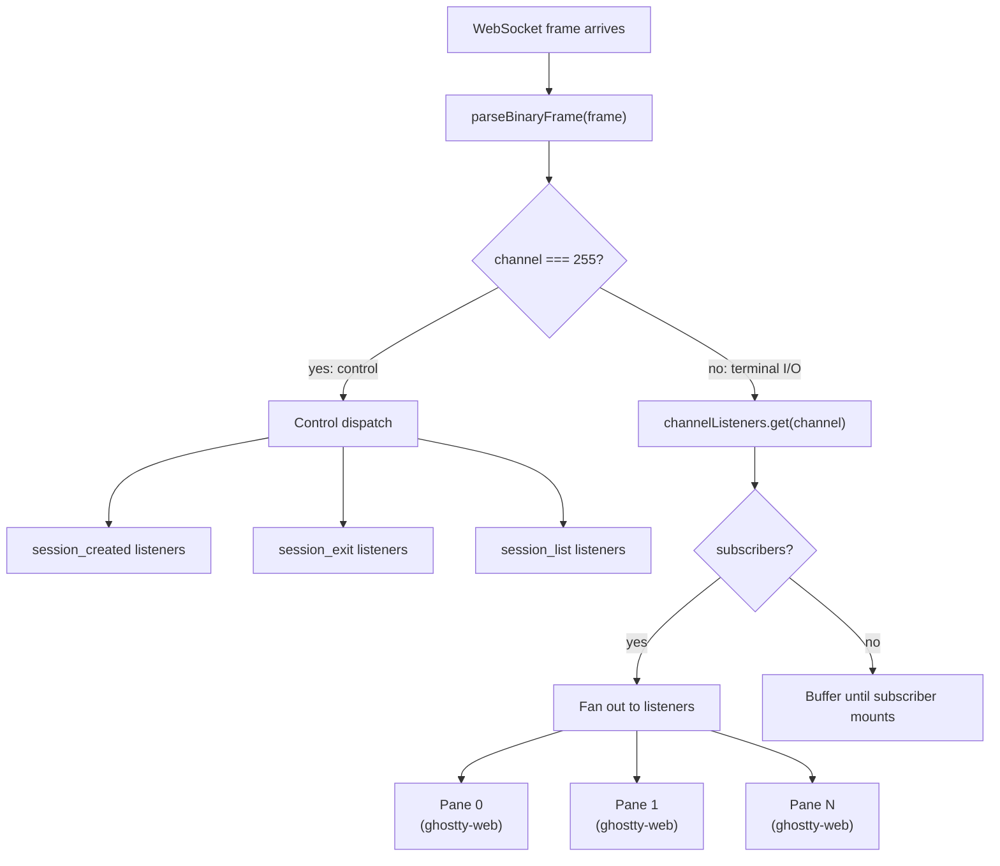

# Tiled Terminals in the Browser

One terminal is useful. Four terminals in a split layout
is home.

The previous six posts covered the backend: the PTY
abstraction, the binary protocol, session lifecycle,
fiber debugging, and the abstractions I killed along the
way. All of that machinery exists to serve one purpose:
make the browser feel like a real terminal multiplexer.
This post is about the frontend that makes it real.

## The layout tree

The first problem is spatial. You have N terminal panes
and you need to arrange them in splits: vertical,
horizontal, nested. This is a window management problem,
and window managers have been solving it with trees for
decades.

I published `@usirin/layout-tree` as a standalone package.
It is a pure functional tree where stacks contain windows
or other stacks, and every operation returns a new tree.
No mutation, no side effects.

```typescript
import * as LT from "@usirin/layout-tree";

const tree = LT.createTree(
  LT.createStack("vertical", [])
);

// Split: creates a new window adjacent to the focused one
const split = LT.split(tree, focused, "horizontal");

// Navigation: find the window to the right
const sibling = LT.findSibling(tree, focused, "right");

// Remove a pane
const pruned = LT.remove(tree, path);

// Update a window's key (used when session IDs arrive)
const updated = LT.updateWindow(tree, path, sessionId);
```

The API surface is small: `createTree`, `createStack`,
`createWindow`, `split`, `remove`, `updateWindow`,
`findSibling`, `getAt`, `findWindowPath`, `swap`,
`moveBefore`, `moveAfter`. Every function is pure. The
tree IS the layout; React just renders it.

This separation matters. The layout logic has zero
dependency on React, zero dependency on the terminal
library, zero dependency on the WebSocket layer. I can
test every split/remove/navigate scenario with plain
unit tests. No DOM, no mocking. The tree is a value.
Transform it, assert the result.

The types enforce the structure:

```typescript
interface Window extends Entity<"window"> {
  key: string;
}

interface Stack extends Entity<"stack"> {
  orientation: Orientation; // "horizontal" | "vertical"
  children: (Window | Stack)[];
}

interface Tree extends Entity<"tree"> {
  root: Stack;
}

type StackPath = number[];
```

A `StackPath` is an array of indices into the tree. `[0]`
is the first child of root. `[1, 0]` is the first child
of the second child of root. Navigation, focus, and
mutation all work through paths. This representation is
simple enough to serialize, diff, and store.

## The gateway: frontend demultiplexer

The backend sends multiplexed binary frames over a single
WebSocket. Channel 0 through 254 carry raw terminal I/O.
Channel 255 carries JSON control messages. The frontend
needs something to parse those frames and route them to
the right consumer. That is `WormholeGateway`.

It is a React context provider. Every component in the
wormhole subtree can call `useWormholeGateway()` to get
access to the connection.

```typescript
export interface WormholeGatewayValue {
  status: GatewayStatus;
  createSession: (cols: number, rows: number) => void;
  attachSession: (
    sessionId: string, cols: number, rows: number
  ) => void;
  detachSession: (sessionId: string) => void;
  resizeSession: (
    sessionId: string, cols: number, rows: number
  ) => void;
  listSessions: () => void;
  sendInput: (channel: number, data: string) => void;
  subscribe: (
    channel: number,
    listener: (data: Uint8Array) => void
  ) => () => void;
  onSessionCreated: (
    cb: (event: SessionCreatedEvent) => void
  ) => () => void;
  onSessionExit: (
    cb: (event: SessionExitEvent) => void
  ) => () => void;
  onSessionList: (
    cb: (sessions: SessionInfo[]) => void
  ) => () => void;
}
```

Three design decisions here that I got wrong before I got
right.

**Channel-based pub/sub.** `subscribe(channel, listener)`
returns an unsubscribe function. Each terminal pane
subscribes to exactly one channel. When a binary frame
arrives on that channel, the listener fires with the raw
payload bytes. No parsing, no copying, no intermediary
data structure.

**Buffering before mount.** Terminal components mount
asynchronously. The ghostty-web WASM module needs to
initialize before the terminal can accept data. But the
backend starts sending scrollback replay the moment you
attach. If data arrives before the subscriber registers,
it goes into a per-channel buffer. When the subscriber
finally calls `subscribe()`, the buffer flushes:

```typescript
const subscribe = useCallback(
  (channel: number, listener: (data: Uint8Array) => void) => {
    if (!channelListeners.current.has(channel)) {
      channelListeners.current.set(channel, new Set());
    }
    channelListeners.current.get(channel)?.add(listener);

    // Flush buffered data from before subscriber mounted
    const buffered = channelBuffers.current.get(channel);
    if (buffered) {
      channelBuffers.current.delete(channel);
      for (const data of buffered) listener(data);
    }

    return () => {
      channelListeners.current.get(channel)?.delete(listener);
    };
  },
  [],
);
```

Without this buffer, you get a blank terminal on reattach.
The scrollback replay arrived, nobody was listening, and
the data was lost. I stared at blank terminals for longer
than I want to admit before adding those six lines.

**Control message dispatch.** All control messages flow
through `sendControl()`, which encodes JSON to a binary
frame on channel 255. Incoming control messages get
dispatched to event listener sets:

```typescript
ws.onmessage = (event) => {
  const frame = new Uint8Array(event.data as ArrayBuffer);
  const {channel, payload} = parseBinaryFrame(frame);

  if (channel === CONTROL_CHANNEL) {
    const msg = JSON.parse(decoder.decode(payload));
    switch (msg.type) {
      case "session_created":
        for (const cb of createdListeners.current) cb(msg);
        break;
      case "session_exit":
        for (const cb of exitListeners.current) cb(msg);
        break;
      case "session_list":
        for (const cb of listListeners.current)
          cb(msg.sessions);
        break;
    }
    return;
  }

  // Route terminal I/O to channel subscribers
  const listeners = channelListeners.current.get(channel);
  if (listeners && listeners.size > 0) {
    for (const listener of listeners) listener(payload);
  } else {
    if (!channelBuffers.current.has(channel)) {
      channelBuffers.current.set(channel, []);
    }
    channelBuffers.current.get(channel)!.push(payload);
  }
};
```

The binary framing function is two lines. One byte for
the channel, then the payload:

```typescript
function encodeBinaryFrame(
  channel: number, payload: Uint8Array
): Uint8Array {
  const frame = new Uint8Array(1 + payload.length);
  frame[0] = channel;
  frame.set(payload, 1);
  return frame;
}
```

One byte of overhead. The protocol disappears.

Here is the data flow through the gateway:



## The state machine: use-wormhole-layout

The layout tree is pure data. The gateway is a connection
manager. Something needs to coordinate them: create a
session on the backend, wait for the `session_created`
response, get the assigned channel, wire it into the
layout tree, and map it to a terminal pane. That
coordinator is `useWormholeLayout`.

It manages three pieces of state:

- `tree`: the layout tree (what is on screen)
- `paneMap`: a `Map<string, PaneInfo>` that maps session
  IDs to `{sessionId, channel}` pairs
- `pendingSplits`: a queue of orientations waiting for
  session creation to complete

The core insight: session creation is asynchronous. When
the user hits Ctrl+Shift+D to split horizontally, I
cannot synchronously add a pane because I do not have a
session ID or channel yet. Instead, the split request
goes into a queue, a `session_create` message goes to
the backend, and when `session_created` arrives, the
queued split executes:

```typescript
useEffect(() => {
  return gateway.onSessionCreated(
    (event: SessionCreatedEvent) => {
      const {sessionId, channel} = event;

      // Reattach: just update channel, don't modify tree
      const existing = paneMap.current.get(sessionId);
      if (existing) {
        paneMap.current.set(
          sessionId, {sessionId, channel}
        );
        return;
      }

      // New session: add to tree
      paneMap.current.set(
        sessionId, {sessionId, channel}
      );

      setTree((prev) => {
        // First session: create initial pane
        if (prev.root.children.length === 0) {
          return LT.createTree(
            LT.createStack("vertical", [
              LT.createWindow(sessionId),
            ])
          );
        }
        // Pending split: consume from queue
        if (pendingSplits.current.length > 0) {
          const orientation =
            pendingSplits.current.shift()!;
          const updated =
            LT.split(prev, focused, orientation);
          const newPath = [
            ...focused.slice(0, -1),
            (focused[focused.length - 1] ?? 0) + 1,
          ];
          return LT.updateWindow(
            updated, newPath, sessionId
          );
        }
        return prev;
      });
    }
  );
}, [gateway, focused]);
```

The reattach check on lines 5 through 9 is critical.
When the WebSocket reconnects, `reattachAll` sends
`session_attach` for every existing session. The backend
responds with `session_created` for each one, but with
potentially different channel assignments. If the
session ID already exists in the pane map, I just update
the channel. The tree stays untouched. The user's layout
survives the reconnect.

The split function queues the orientation and fires off
a create request:

```typescript
const splitPane = useCallback(
  (
    orientation: LT.Orientation,
    cols: number, rows: number
  ) => {
    pendingSplits.current.push(orientation);
    gateway.createSession(cols, rows);
  },
  [gateway],
);
```

And reconnection reattaches everything:

```typescript
const reattachAll = useCallback(
  (cols: number, rows: number) => {
    for (const [, info] of paneMap.current) {
      gateway.attachSession(
        info.sessionId, cols, rows
      );
    }
  },
  [gateway],
);
```

The `WormholeLayout` component detects disconnection and
triggers reattach on reconnect:

```typescript
useEffect(() => {
  if (gateway.status === "disconnected") {
    wasDisconnected.current = true;
    return;
  }
  if (gateway.status !== "connected") return;

  // Reconnect: reattach all existing sessions
  if (
    wasDisconnected.current &&
    layout.sessionCount() > 0
  ) {
    wasDisconnected.current = false;
    layout.reattachAll(80, 24);
    return;
  }

  // First connect: create initial session
  if (initialized.current) return;
  initialized.current = true;
  wasDisconnected.current = false;
  layout.createInitialSession(80, 24);
}, [gateway.status]);
```

## Per-user DO isolation

On the backend, each user gets their own Durable Object
instance. The routing is one line:

```typescript
const id = c.env.WORMHOLE_DO.idFromName(userId);
const stub = c.env.WORMHOLE_DO.get(id);
return stub.fetch(c.req.raw);
```

`idFromName(userId)` deterministically maps a user ID to
a DO instance. Your terminals are your terminals. No
shared state between users. No multi-tenant session
confusion. The DO holds your sessions in memory, routes
your WebSocket messages, and persists your state. When
you disconnect, it keeps running. When you reconnect from
another device, it is the same instance with the same
sessions.

## ghostty-web integration

Each terminal pane renders a ghostty-web instance. This
is not xterm.js. It is Mitchell Hashimoto's terminal
emulator compiled to WebAssembly: GPU-accelerated
rendering via WebGL, proper font shaping, the same
codebase that runs natively on macOS and Linux.

The integration flows through three layers.

`useTerminal` from `@kampus/ghostty-react` initializes
the WASM module, creates a `Terminal` instance, and
manages its lifecycle with a callback ref:

```typescript
const ref = useCallback((element: HTMLDivElement | null) => {
  if (elementRef.current === element) return;

  // Cleanup previous terminal
  if (elementRef.current) {
    fitAddonRef.current?.dispose();
    setTerminal((prev) => { prev?.dispose(); return null; });
  }

  elementRef.current = element;
  if (!element) return;

  init().then(() => {
    const term = new Terminal(termOptions);
    term.onData((data) => onDataRef.current?.(data));
    term.onResize((size) => onResizeRef.current?.(size));

    const fitAddon = new FitAddon();
    term.loadAddon(fitAddon);
    term.open(element);
    fitAddon.fit();
    fitAddon.observeResize();

    setTerminal(term);
  });
}, []);
```

`useChannelTerminal` wires a ghostty-web terminal to a
specific channel on the gateway:

```typescript
export function useChannelTerminal(
  options: UseChannelTerminalOptions
) {
  const {channel, sessionId, theme} = options;
  const gateway = useWormholeGateway();

  const {ref, write, terminal, ready} = useTerminal({
    theme,
    onData: (data) => gateway.sendInput(channel, data),
    onResize: (size) =>
      gateway.resizeSession(
        sessionId, size.cols, size.rows
      ),
  });

  useEffect(() => {
    if (!ready) return;
    return gateway.subscribe(
      channel, (data) => write(data)
    );
  }, [ready, channel, gateway, write]);

  return {ref, terminal, ready};
}
```

`TerminalPane` renders the div and handles focus:

```typescript
export function TerminalPane({
  channel, sessionId, focused, onFocus, theme
}: TerminalPaneProps) {
  const {ref} = useChannelTerminal({
    channel, sessionId, theme
  });

  return (
    <div
      className={styles.pane}
      data-focused={focused || undefined}
      onClick={onFocus}
      ref={ref}
    />
  );
}
```

The focused pane gets full opacity; unfocused panes dim
to 0.65. A CSS transition makes the focus shift smooth:

```css
.pane {
  width: 100%;
  height: 100%;
  opacity: 0.65;
  transition: opacity 0.15s ease;
}

.pane[data-focused] {
  opacity: 1;
}
```

## Keybindings

The layout component registers global keybindings for
pane management. All bound to Ctrl+Shift to avoid
conflicting with terminal input:

| Shortcut            | Action           |
|---------------------|------------------|
| Ctrl+Shift+D        | Split horizontal |
| Ctrl+Shift+E        | Split vertical   |
| Ctrl+Shift+W        | Close pane       |
| Ctrl+Shift+Arrow    | Focus direction  |

ghostty-web needs to know about these keybindings too,
otherwise it swallows the events before they reach the
layout handler. The `useChannelTerminal` hook registers
a custom key event handler:

```typescript
terminal.attachCustomKeyEventHandler(
  (e: KeyboardEvent) => {
    if (e.ctrlKey && e.shiftKey) {
      switch (e.code) {
        case "KeyD":
        case "KeyE":
        case "KeyW":
        case "ArrowLeft":
        case "ArrowRight":
        case "ArrowUp":
        case "ArrowDown":
          return true; // "handled, preventDefault"
      }
    }
    return false; // "not handled, pass to terminal"
  }
);
```

Returning `true` tells ghostty-web "I handled this, call
preventDefault but do not stopPropagation." The event
bubbles up to the layout's global keydown listener, which
dispatches the split or focus change.

## Session lifecycle

The full lifecycle of a pane:

1. **Create**: user hits Ctrl+Shift+D. Orientation queued,
   `session_create` sent to backend.
2. **Wire**: `session_created` arrives with sessionId and
   channel. Pane map updated, tree split executed.
3. **Render**: React renders a new `TerminalPane`.
   ghostty-web initializes, subscribes to the channel.
   Buffered scrollback data flushes.
4. **Use**: keystrokes flow through `sendInput(channel)`.
   Output flows through `subscribe(channel)`. Resize
   events flow through `resizeSession`.
5. **Disconnect**: WebSocket drops. Panes go dim.
   Sessions keep running on the DO.
6. **Reconnect**: WebSocket reopens. `reattachAll` sends
   attach for every session in the pane map. Backend
   responds with `session_created` for each, potentially
   with new channel assignments. Pane map updates
   channels. Tree unchanged. Layout preserved.
7. **Close**: user hits Ctrl+Shift+W. `detachSession`
   sent, pane removed from tree.

Sessions survive across connections. The layout tree
preserves pane arrangement; the gateway handles
reconnection. The user closes their laptop, opens it
tomorrow, and their four-pane layout is waiting.

## Rendering the tree

The `WormholeLayout` component walks the tree recursively
with `react-resizable-panels`. Stacks become `Group`
components with an orientation. Windows become `Panel`
components containing a `TerminalPane`. Separators
between panels let you drag to resize:

```typescript
function renderChildren(
  stack: LT.Stack,
  path: LT.StackPath,
  layout: ReturnType<typeof useWormholeLayout>,
) {
  return stack.children.map((child, i) => {
    const childPath = [...path, i];
    return (
      <Fragment key={child.id}>
        {i > 0 && (
          <Separator className={styles.resizeHandle} />
        )}
        <Panel>
          {child.tag === "window"
            ? renderWindow(child, childPath, layout)
            : (
              <Group orientation={child.orientation}>
                {renderChildren(
                  child, childPath, layout
                )}
              </Group>
            )}
        </Panel>
      </Fragment>
    );
  });
}
```

The tree's recursive structure maps directly to the
component tree. A vertical stack with two children
renders as a vertical `Group` with two `Panel`s. If one
of those children is a horizontal stack, it nests a
horizontal `Group` inside its `Panel`. Arbitrary nesting
falls out naturally.

## What I got wrong

The first version had no buffering. Data arrived before
the terminal mounted, vanished, and I saw blank panes on
every reattach. Six lines of buffer code fixed it, but I
spent a day blaming the backend before I looked at the
frontend.

The first version also modified the tree on reattach. A
reconnect would duplicate every pane because the
`session_created` handler always added a new window. The
fix was the three-line check: if the session ID exists
in the pane map, just update the channel.

Both bugs had the same root cause: I was thinking about
the frontend as a dumb renderer. It is not. The frontend
is where the protocol becomes the user experience, and
every race condition between "network event arrives" and
"component finishes mounting" is a bug the user will see.

## The lesson

The frontend is where multiplexing becomes real. The
binary protocol, the channel routing, the session
lifecycle: all of that machinery exists so the user can
look at their screen and see panes. Not frames. Not
channels. Not WebSocket messages. Panes, with cursors
blinking, shells waiting for input, output scrolling.

The protocol disappears. The user just sees terminals.

That is the whole point.

## Series wrap-up

This was the last post in the seven-part build journal.
Here is the full series:

1. **Why I'm building my own terminal multiplexer**: the
   itch, the vision, and the stack
2. **From prototype to package**: Bun's silent failure,
   extracting `@kampus/wormhole`
3. **Binary protocol design**: the mux framing layer
4. **Running a PTY on Cloudflare's edge**: Sandbox, DOs,
   and the lifecycle
5. **Fiber lifecycle debugging**: the hardest bugs I hit
6. **Killing abstractions that fight the platform**: what
   I threw away and why
7. **Tiled terminals in the browser**: layout, ghostty-web,
   and the frontend (this post)

Wormhole is not done. There is no tab management yet, no
persistent layout serialization, no collaboration mode.
But the core loop works: open a browser, get terminals,
split them, close your laptop, open it again, and
everything is still there.

If you want to follow along or contribute, the code lives
at [github.com/kamp-us/kampus](https://github.com/kamp-us/kampus).
