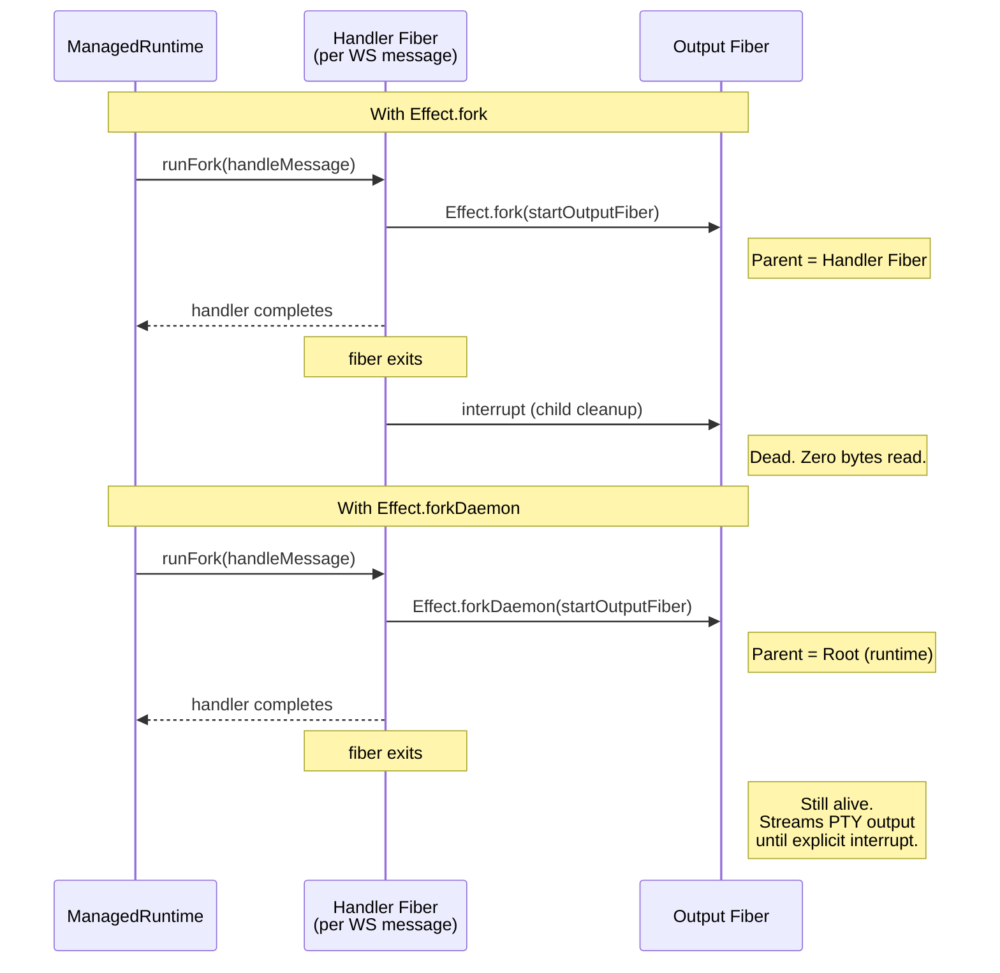

# When Your Fibers Die Silently

The terminal connected. The session created. The screen stayed
blank.

## The symptom

Everything looked correct. The client sent `session_create`.
The server responded with `session_created` and a channel
assignment. The PTY spawned. The distribution fiber inside
`Session` was happily pushing output into client queues. I
could verify this with logging: `Queue.offer` was succeeding.

But the browser showed nothing. The ghostty-web terminal sat
there, cursor blinking on an empty screen, waiting for bytes
that would never arrive.

The mux handler's output fiber, the one responsible for
draining `Stream.fromQueue(queue)` and sending binary frames
over the WebSocket, was not emitting. It was not erroring. It
was not stuck. It simply did not exist anymore.

Tests passed. All of them. `"PTY output arrives on assigned
channel as binary"` was green. The resurrection test was
green. Everything was green.

Production was blank.

## The investigation

I added diagnostic logging at every stage of the output
pipeline. The distribution fiber inside `Session` was running:

```typescript
// session.ts: distribution fiber
yield* proc.output.pipe(
  Stream.runForEach((data) =>
    Effect.gen(function* () {
      buffer.push(data);
      const map = yield* Ref.get(clients);
      yield* Effect.forEach(
        map.values(),
        (entry) => Queue.offer(entry.queue, data),
        { concurrency: "unbounded", discard: true },
      );
    }),
  ),
  Effect.forkIn(sessionScope),
);
```

Data was reaching the queues. I could see `Queue.offer`
completing. So the problem was downstream: the output fiber in
`muxHandler.ts` that reads from the queue and sends frames to
the WebSocket.

I added a log at the start of `startOutputFiber`. It never
printed. The fiber was being interrupted before it could
execute its first instruction.

But by what?

## The root cause

Effect's fiber model. Every fiber has a parent. When the
parent fiber completes or is interrupted, all its children are
interrupted too. This is structured concurrency: it prevents
resource leaks by ensuring child fibers cannot outlive their
parent scope.

In production, the Cloudflare Durable Object uses native
WebSocket event listeners. Each incoming message gets its own
fiber via `runtime.runFork`:

```typescript
// WormholeDO.ts
server.addEventListener("message", (evt: MessageEvent) => {
  const data =
    evt.data instanceof ArrayBuffer
      ? new Uint8Array(evt.data)
      : new TextEncoder().encode(evt.data as string);
  this.runtime.runFork(handler.handleMessage(data));
});
```

`runtime.runFork` creates a new fiber for each message. That
fiber runs `handleMessage`, which for a `session_create`
message does this: creates the session, attaches a client,
sends back `session_created`, and forks the output fiber.

Here is the critical part. The handler fiber is short-lived.
It processes one message and completes. With `Effect.fork`,
the output fiber becomes a child of that handler fiber. When
the handler completes (after sending `session_created` back to
the client), Effect's runtime interrupts all children.

The output fiber is a child of that handler. Dead before it
reads a single byte from the queue.

The sequence looks like this:



## Why tests passed

Tests use a different execution model. The mock handler in
the test suite calls `handleMessage` directly inside an
`Effect.gen` block:

```typescript
// Server.test.ts
const makeMuxMockHandler = Effect.gen(function* () {
  const outgoing = yield* Queue.unbounded<Uint8Array>();
  const send = (data: Uint8Array) =>
    Queue.offer(outgoing, data).pipe(Effect.asVoid);
  const close = (_code: number, _reason: string) =>
    Effect.void;

  const handler = yield* makeMuxHandlerFn({ send, close });

  return {
    sendControl: (msg: object) => {
      const frame = encodeBinaryFrame(
        CONTROL_CHANNEL,
        new TextEncoder().encode(JSON.stringify(msg)),
      );
      return handler.handleMessage(frame);
    },
    // ...
  };
});
```

When the test calls `yield* sendControl(...)`, that runs
`handleMessage` inside the test's own `Effect.gen` fiber.
That fiber is long-lived; it survives until the test
completes. So any child forked with `Effect.fork` inside
`handleMessage` inherits the test fiber as its parent, and
the test fiber does not die until after the assertions run.

Both execution strategies are valid. Both call the same
`handleMessage` function. But they have different fiber
parentage semantics. In the test, the parent outlives the
child. In production, the parent dies immediately.

## The fix

One line:

```typescript
// BEFORE: output fiber dies with its parent handler
const fiber = yield* startOutputFiber(
  channel, sessionId, handle
).pipe(Effect.fork);

// AFTER: output fiber lives in the global scope
const fiber = yield* startOutputFiber(
  channel, sessionId, handle
).pipe(Effect.forkDaemon);
```

`Effect.forkDaemon` forks the fiber into the global scope,
parented to the runtime root. The handler fiber can complete
freely; the output fiber survives. Lifecycle management is
already handled explicitly by the `cleanup` function, which
calls `Fiber.interrupt(entry.outputFiber)` on connection
close:

```typescript
const teardownEntry = (channel: number) =>
  Effect.gen(function* () {
    const entry = entries.get(channel);
    if (!entry) return;
    yield* entry.handle.close;
    yield* Fiber.interrupt(entry.outputFiber);
    entries.delete(channel);
    yield* channelMap.release(channel);
  });
```

There is also a second detail that matters: the
`session_created` control message must be sent *before*
forking the output fiber. If you fork first, the output fiber
can start sending data frames before the client has received
its channel assignment. The client would see binary data on a
channel it does not know about yet and discard it. The
`registerEntry` function handles this ordering:

```typescript
const registerEntry = (
  channel: number,
  sessionId: string,
  session: Session,
  handle: ClientHandle,
) =>
  Effect.gen(function* () {
    yield* sendControl(
      new SessionCreatedResponse({
        type: "session_created",
        sessionId,
        channel,
      }),
    );
    const fiber = yield* startOutputFiber(
      channel, sessionId, handle
    ).pipe(Effect.forkDaemon);
    entries.set(channel, {
      session, handle, outputFiber: fiber,
    });
  });
```

Send the control message. Then fork. The ordering is
sequential within the generator, so this is guaranteed.

## How to think about fiber lifecycle in Effect

Effect gives you four ways to fork a fiber. Each one answers
the question "who owns this fiber's lifetime?"

- **`Effect.fork`**: child of the current fiber. Dies when
  the parent fiber completes or is interrupted. This is the
  default, and it is correct when the parent will outlive the
  child.

- **`Effect.forkScoped`**: child of the current `Scope`. Dies
  when the scope closes. Useful when you have an explicit
  scope that represents a resource lifetime (like a
  connection or a session).

- **`Effect.forkDaemon`**: child of the runtime root. Lives
  until you explicitly call `Fiber.interrupt` or the entire
  runtime shuts down. Use this when the fiber must outlive
  its spawning context.

- **`Effect.forkIn(scope)`**: child of a specific scope you
  pass in. This is the general form; you choose exactly which
  scope owns the fiber.

The question to ask before every fork: "Will the parent fiber
outlive this child?" If the answer is no, you need
`forkDaemon` or `forkIn` with a longer-lived scope.

In the earlier iteration of the code (before the event-driven
refactor), the mux handler ran inside a `Socket.runRaw` fiber
that lived for the entire connection. I used `forkIn` with
the connection scope:

```typescript
// earlier version: forkIn(connectionScope)
const connectionScope = (yield* Effect.scope) as Scope.Scope;
// ...
const fiber = yield* startOutputFiber(
  channel, sessionId, handle
).pipe(Effect.forkIn(connectionScope));
```

After refactoring to native `addEventListener` on the CF
WebSocket (where each message is an independent `runFork`),
there was no connection scope to fork into. The handler fiber
is ephemeral. `forkDaemon` is the right answer here because
the cleanup logic already manages fiber interruption
explicitly.

## The deeper pattern

This bug only manifested in production because the test
mock's execution model was fundamentally different from
production's. The test ran all handlers in one long-lived
fiber. Production spawned a new fiber per message. Both were
valid execution strategies, but they had different fiber
parentage semantics.

This is a class of bug that structured concurrency
introduces. In unstructured concurrency (raw threads,
goroutines, `Promise.all`), spawned work has no parent. It
just runs. You get resource leaks instead of premature
interruption. Structured concurrency trades one failure mode
for another: instead of leaking fibers that should have died,
you kill fibers that should have lived.

The fix is always the same: be explicit about lifetime. If a
fiber needs to outlive its spawning context, say so. If you
are not sure, add a log at the start of the fiber and watch
whether it ever prints. If it does not, check who the parent
is and whether that parent is still alive.

## Journal

- **Session**: Fix wormhole output fiber interrupted by
  short-lived handler fiber
- **Date**: 2026-02-12
- **Duration**: 1h20m
- **Branch**: umut/wormhole-mux-sessions

## The lesson

In Effect, every fiber has a parent. When the parent dies,
children die too. Know when you need an orphan.

---

*This is post 5 of 7 in the wormhole build journal. Next up:
killing abstractions that fight the platform.*
